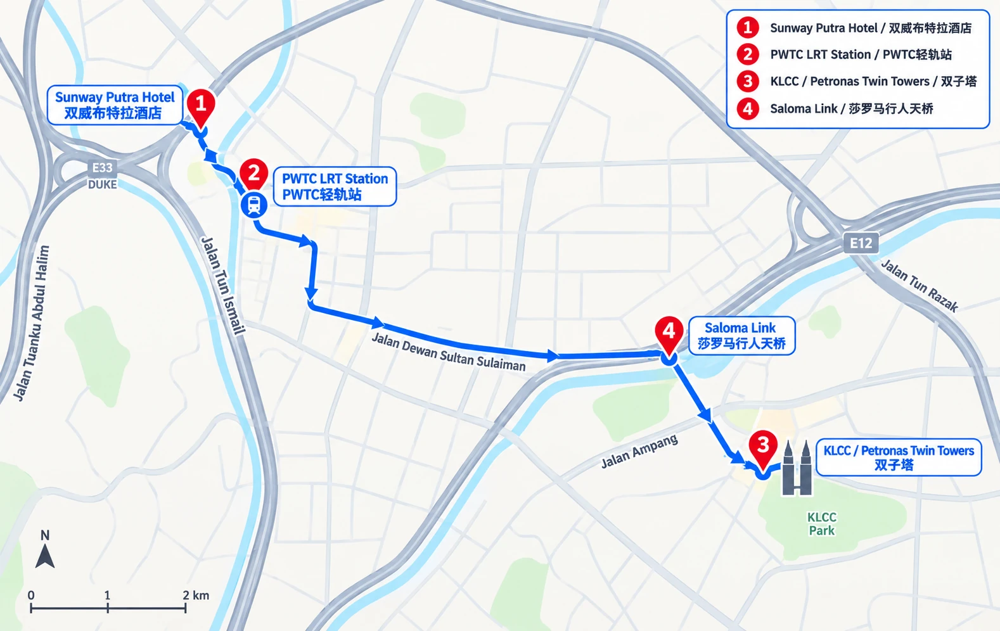
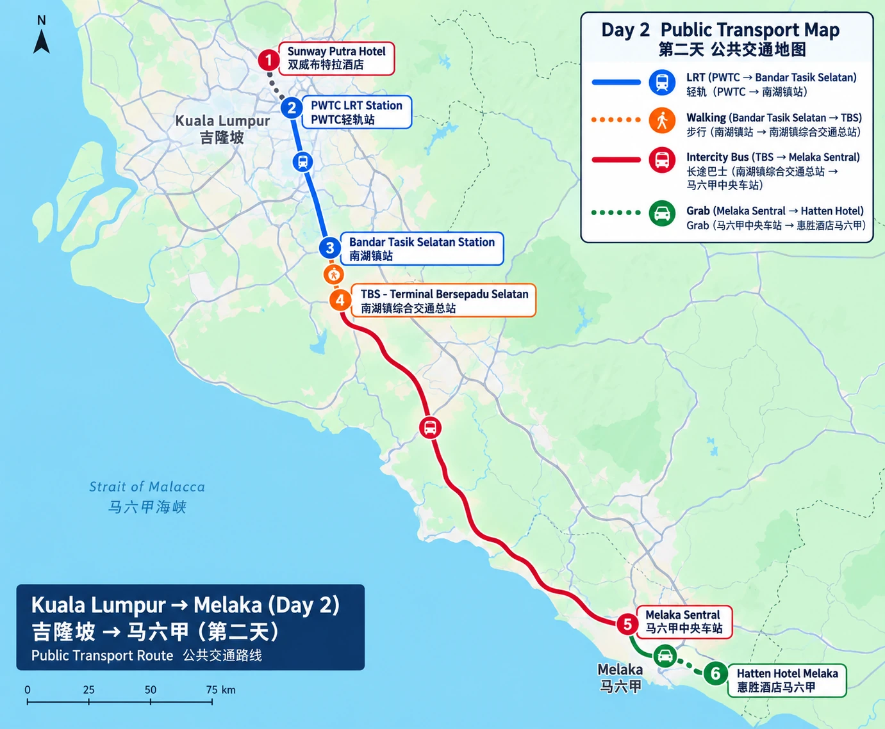
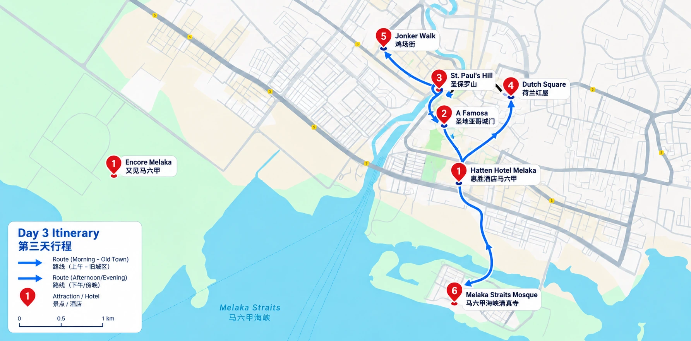

# 每日行程

## 关键地点速记 / Key Places

### 航班 / Flights

- 去程 / Outbound：AK113，10/15 广州 CAN T3 10:20 → 吉隆坡 KUL T2 14:40
- 返程 / Return：AK116，10/18 吉隆坡 KUL T2 16:35 → 广州 CAN T3 20:55

### 酒店 / Hotels

- 吉隆坡 / Kuala Lumpur：Sunway Putra Hotel Kuala Lumpur，Sunway Putra Mall, 100 Jalan Putra, Chow Kit, 50350 Kuala Lumpur
- 马六甲 / Melaka：Hatten Hotel Melaka，Jalan Merdeka, Banda Hilir, 75000 Melaka

### 全程记忆路线 / Route Memory

**广州白云 T3 → 吉隆坡 KUL T2 → Sunway Putra Hotel → KLCC → 马六甲 Hatten Hotel → Dutch Square / Jonker Walk → Melaka Straits Mosque → KUL T2 → 广州白云 T3**

其中机场和两家酒店是全程必经地点；KLCC、Dutch Square / Jonker Walk 和 Melaka Straits Mosque 是主要体验地点；Saloma Link 是可根据体力和天气取消的补充地点。
这里维护每日的详细路线。根目录 [README](../README.md) 只展示总计划和快速入口。

## Day 1 · 10/15：吉隆坡夜景

### 今日目标

顺利抵达、完成入住，在酒店泳池休息观景后，再用一个轻松的傍晚感受吉隆坡的现代城市夜景。第一天不安排大量景点，也不为了打卡在城市之间来回奔波。

### 时间线

| 时段 | 安排 | 说明 |
| --- | --- | --- |
| 下午 | 抵达 KUL T2，完成入境、取行李并与接机司机会合 | 司机接到 4 人后直接前往 Sunway Putra Hotel Kuala Lumpur |
| 下午 | 酒店入住、泳池休息和观景 | 先放松、看看城市景观，再回房间换衣服和补妆 |
| 傍晚 | 前往 KLCC 和 Petronas Twin Towers / 双子塔 | 以城市散步、双子塔拍照和周边用餐为主 |
| 晚上 | 视体力前往 Saloma Link / 莎罗马行人天桥 | 作为补充夜景机位，下雨或疲劳时可以取消 |
| 晚上 | 晚餐后返回酒店 | 不再安排远距离景点，保持第一天轻松 |

### 酒店泳池休息

入住 Sunway Putra Hotel 后，先不急着出门，安排一段泳池休息和观景时间：

- 放下行李后前往酒店泳池，游泳、休息或欣赏周边城市景观。
- 这段时间也可以作为换衣服、补妆和调整状态的缓冲。
- 如果天气、泳池开放时间或抵达时间不合适，就改为在房间或酒店公共区域休息。
- 泳池休息和 KLCC 夜景都是 Day 1 的体验重点；时间不足时优先保证休息，再决定是否前往 Saloma Link。
### 地点说明

#### [KLCC](https://www.google.com/maps/search/?api=1&query=KLCC+Park%2C+Kuala+Lumpur) / [Petronas Twin Towers / 双子塔](https://www.google.com/maps/search/?api=1&query=Petronas+Twin+Towers%2C+Kuala+Lumpur)

这是第一晚的核心区域。KLCC（Kuala Lumpur City Centre）是吉隆坡现代城市发展的代表性片区，双子塔、Suria KLCC 商场、KLCC Park 和周边酒店集中在一起，适合四人合照，也适合在商场、广场和步道之间灵活调整。

Petronas Twin Towers 于 1990 年代建成，1999 年正式启用，曾在 1998-2004 年间保持世界最高建筑纪录；双塔的几何造型也融入了伊斯兰艺术元素。这里不仅是拍照地，也是马来西亚现代化和国家城市形象的重要象征。

建议至少留出一个半小时：先拍城市环境，再拍双子塔亮灯后的合照和个人照片。

如果大家抵达后明显疲惫，KLCC 本身就足够完成第一晚，不必强行前往其他地点。

#### [Saloma Link / 莎罗马行人天桥](https://www.google.com/maps/search/?api=1&query=Saloma+Link%2C+Lorong+Raja+Muda+Musa+3%2C+Kampung+Baru%2C+Kuala+Lumpur)

Saloma Link 是一座跨越 Klang River 的步行和自行车桥，连接传统社区 Kampung Baru 与现代化的 KLCC 区域，全长约 69 米。它的意义不只是一个拍照点：从桥上可以看到两种城市景观的对照，一侧是 Kampung Baru 的传统马来社区，另一侧是双子塔和 KLCC 的现代天际线。

它适合作为双子塔之后的补充机位，可以拍桥体灯光、城市夜景和人物剪影。它不是第一天的必到点：如果下雨、排队、交通不顺或大家已经累了，直接取消不会影响当天体验。

### 餐饮与购买安排（待确认）

#### 晚餐：确定在 KLCC 解决

Day 1 晚餐暂定在 **Suria KLCC** 区域解决，具体餐厅到时根据大家口味、排队情况和体力再确定：

- **主选：Little Penang Kafé**：主打槟城风味，适合第一次到马来西亚时尝试较有代表性的地方口味。4 人可以考虑分食槟城炒粿条、槟城叻沙、椰浆饭或其他当地小吃类菜品；具体菜单以当天为准。
- **备用：Signatures Food Court**：如果主选排队、临时关闭或大家抵达后比较疲惫，就改到 Suria KLCC 的美食广场，选择多、座位相对灵活，也方便继续拍照或直接回酒店。
- **晚餐原则**：先完成四人合照和双子塔夜景，再吃饭；不为了寻找“更特别”的餐厅离开 KLCC 区域。

#### 第一天值得购买什么

第一天暂不安排正式购物，只建议购买当晚和旅途中马上需要的东西：饮水、纸巾、防晒或简单零食。咖啡、零食、伴手礼等特色购买留到 Day 2 和 Day 3，在马六甲或返程前集中完成，避免带着购物袋影响拍照和换乘。
### 当天交通建议

- 抵达 KUL T2 后，完成入境和取行李，前往到达出口与 Trip.com 接机司机会合。
- 司机接到 4 人后，直接前往 Sunway Putra Hotel Kuala Lumpur。
- 晚上在 KLCC 和 Saloma Link 之间移动时，根据天气、体力和现场人流决定是否步行或叫车。
- 晚餐后直接回酒店，不再安排远距离夜景点。

### 拍照与穿搭建议

- 酒店休息时完成第一轮换衣服和补妆，减少到景区后反复折返。
- 双子塔建议拍两组：蓝调时刻一组、完全亮灯后一组。
- 四人合照最好在刚到 KLCC 时先完成，避免越晚人越累。
- Saloma Link 适合拍人物剪影和夜景，不必为单一机位等待太久。

### 弹性规则

- 航班或入境延误：保留 KLCC，取消 Saloma Link。
- 下午体力不足：优先保留酒店泳池或房间休息，晚餐就在 KLCC 解决。
- 天气不好：改为 KLCC 商场、室内用餐和短距离拍照。
- 大家特别喜欢 KLCC：可以停留更久，不需要为了完成后续地点赶路。

## Day 1 路线图 / Day 1 Route Map

### 地点链接 / Google Maps Links

1. [Sunway Putra Hotel Kuala Lumpur / 双威布特拉酒店](https://www.google.com/maps/search/?api=1&query=Sunway+Putra+Hotel%2C+100+Jalan+Putra%2C+Kuala+Lumpur)
2. [PWTC LRT Station / PWTC 轻轨站](https://www.google.com/maps/search/?api=1&query=PWTC+LRT+Station%2C+Kuala+Lumpur)
3. [KLCC / Petronas Twin Towers / 双子塔](https://www.google.com/maps/search/?api=1&query=Petronas+Twin+Towers%2C+Kuala+Lumpur)
4. [Saloma Link / 莎罗马行人天桥](https://www.google.com/maps/search/?api=1&query=Saloma+Link%2C+Lorong+Raja+Muda+Musa+3%2C+Kampung+Baru%2C+Kuala+Lumpur)

> 路线图用于记忆地点和大致方向；实际步行、乘车和入口位置以当天 Google Maps、现场标识和交通情况为准。
## Day 2 · 10/16：吉隆坡街区 → 马六甲夜市

### 今日目标

上午在吉隆坡老城区慢慢游玩，下午回 Sunway Putra Hotel 取行李，再通过公共交通前往马六甲。今天区域跨度较大，重点是控制行李、减少折返，并给跨城交通预留足够弹性。

### 时间线

| 时段 | 安排 | 说明 |
| --- | --- | --- |
| 上午 | Sunway Putra Hotel → 鬼仔巷、茨厂街 | 不带大件行李，以街拍、建筑、咖啡和小吃为主 |
| 中午 | 吉隆坡老城区午餐和休息 | 不安排过多景点，保留回酒店取行李的时间 |
| 下午 | 返回酒店取行李 → 前往 TBS | 行李多或天气炎热时，酒店到 TBS 可改用 Grab |
| 下午至傍晚 | TBS → Melaka Sentral | 乘公共汽车前往马六甲，车次和余票出发前确认 |
| 傍晚 | Melaka Sentral → Hatten Hotel Melaka | 带行李优先 Grab，先入住、放行李和休息 |
| 晚上 | 荷兰红屋、基督教堂、鸡场街夜市 | 视抵达时间和体力安排，累了就缩短路线 |

### 地点说明

#### [Kwai Chai Hong / 鬼仔巷](https://www.google.com/maps/search/?api=1&query=Kwai+Chai+Hong+Kuala+Lumpur)

鬼仔巷位于吉隆坡老城区，以旧街巷、壁画和南洋城市记忆为主要特色，适合上午街拍和慢慢观察建筑细节。这里不需要安排很长时间，重点是拍照、散步和找一家咖啡馆休息。

#### [Petaling Street / 茨厂街](https://www.google.com/maps/search/?api=1&query=Petaling+Street+Chinatown+Kuala+Lumpur)

茨厂街是吉隆坡较有代表性的老街区，适合和鬼仔巷安排在同一个上午。这里可以吃小吃、买一些小物件，但不建议在前往马六甲前购买太多东西，以免增加行李负担。

#### [Dutch Square / 荷兰红屋](https://www.google.com/maps/search/?api=1&query=Dutch+Square+Melaka)

荷兰红屋是马六甲最容易辨认的城市地标之一，适合入住后作为第一处夜间古城拍照点。抵达时间较晚时，只保留红屋、基督教堂和河边散步即可。

#### [Jonker Walk / 鸡场街](https://www.google.com/maps/search/?api=1&query=Jonker+Walk+Melaka)

鸡场街是第二天晚上的主要活动区域，适合逛夜市、吃小吃和感受古城夜间氛围。因为这天是周五，夜市安排优先级较高；如果大家疲惫，就以鸡场街为主，不再扩展其他景点。

### 餐饮安排（待确认）

- 上午：在鬼仔巷、茨厂街一带寻找咖啡、小吃或简单午餐。
- 晚上：以鸡场街夜市为主，现场选择小吃和饮品。
- 马六甲正餐候选暂不锁定，优先留给 Day 3 的娘惹菜安排。
- 4 人如果意见不同，可以分开选择后在约定地点集合，不必为了统一餐厅反复换区。

### 当天交通建议

#### 酒店 → 吉隆坡老城区

1. 从 Sunway Putra Hotel 通过 Sunway Putra Mall 连通通道前往 PWTC LRT Station。
2. 乘 Ampang Line 或 Sri Petaling Line 前往 Masjid Jamek Station。
3. 在 Masjid Jamek 换乘 Kelana Jaya Line，前往 Pasar Seni Station。
4. 从 Pasar Seni 步行前往 Petaling Street，再步行或短途前往 Kwai Chai Hong。

#### 老城区 → 酒店取行李

午餐后原路返回 Pasar Seni，经 Masjid Jamek 换乘回 PWTC，回酒店领取寄存行李。若时间紧、天气炎热或行李较多，可以直接从老城区叫 Grab 回酒店。

#### 酒店 → TBS

1. 从酒店回到 PWTC LRT Station。
2. 乘 Sri Petaling Line，往 Putra Heights 方向。
3. 在 Bandar Tasik Selatan Station 下车。
4. 按指示沿连通通道前往 TBS - Terminal Bersepadu Selatan。
5. 在 TBS 确认目的地为 Melaka Sentral，购买或使用前往马六甲的车票。

### 路线优化说明

这一天看起来会经过多个地点，但核心只需要记住两件事：**上午轻装游览，下午集中转移**。

- 不带大件行李去鬼仔巷和茨厂街：先寄存在 Sunway Putra Hotel，避免拖行李走老街和换乘。
- 午餐后回酒店取行李虽然会产生一次折返，但比带着行李游览、寄存到陌生地点更稳定，也更容易控制物品安全。
- 酒店到 TBS：行李少、天气好时走 LRT；行李多、天气热或时间紧时直接 Grab，4 人分摊后更舒服。
- TBS 到 Melaka Sentral：建议提前确认并购买长途巴士票，目标是下午出发，不把抵达时间压到晚上太晚。
- Melaka Sentral 到 Hatten Hotel：不再换乘市内公交，4 人带行李直接 Grab。
#### TBS → 马六甲酒店

长途公共汽车到达 Melaka Sentral 后，4 人先集合并清点行李，再叫 Grab 前往 Hatten Hotel Melaka。当天不建议拖着行李换乘马六甲市内公交。

### 拍照与穿搭建议

- 上午老城区适合轻便、方便步行的衣服和鞋子。
- 鬼仔巷适合街拍，茨厂街适合生活感和建筑照片。
- 马六甲入住后可换一套适合古城夜景和夜市的衣服。
- 由于当天需要拖行李和换乘，拍照服装尽量放在随身小包，避免翻找大件行李。

### 弹性规则

- 吉隆坡上午出发晚了：优先茨厂街或鬼仔巷其中一个，不要两个都赶。
- 老城区逛得开心：保证午后按时回酒店取行李，避免影响巴士。
- 行李多或下雨：酒店 → TBS 使用 Grab，保留 TBS → Melaka Sentral 的公共汽车。
- 长途车延误：入住后只逛鸡场街，不强行完成整套古城路线。
- 大家疲惫：晚餐和夜市结束后直接回 Hatten Hotel。

### 交通地点记忆 / Bilingual Waypoints

**Sunway Putra Hotel → PWTC LRT Station → Masjid Jamek Station → Pasar Seni Station → Petaling Street / Kwai Chai Hong → Bandar Tasik Selatan Station → TBS → Melaka Sentral → Hatten Hotel Melaka**

| 顺序 | 中文地点 | English | 作用 |
| --- | --- | --- | --- |
| 1 | 双威布特拉酒店 | Sunway Putra Hotel Kuala Lumpur | 出发点、取行李点 |
| 2 | PWTC 轻轨站 | PWTC LRT Station | 酒店附近上车点 |
| 3 | 清真寺占美站 | Masjid Jamek Station | 去老城区时的换乘点 |
| 4 | 巴刹南市场站 | Pasar Seni Station | 茨厂街、鬼仔巷方向 |
| 5 | 南湖镇站 | Bandar Tasik Selatan Station | 前往 TBS 的下车点 |
| 6 | 南湖镇综合交通总站 | TBS - Terminal Bersepadu Selatan | 长途巴士出发总站 |
| 7 | 马六甲中央车站 | Melaka Sentral | 长途巴士到达站 |
| 8 | 哈登酒店马六甲 | Hatten Hotel Melaka | 马六甲入住点 |

> 站台编号和具体候车区以当天车票、电子屏和工作人员指引为准。路线图用于记忆交通顺序，实际车次、站台和道路情况以当天现场信息为准。

### 地点链接 / Google Maps Links

- [Sunway Putra Hotel Kuala Lumpur / 双威布特拉酒店](https://www.google.com/maps/search/?api=1&query=Sunway+Putra+Hotel%2C+100+Jalan+Putra%2C+Kuala+Lumpur)
- [PWTC LRT Station / PWTC 轻轨站](https://www.google.com/maps/search/?api=1&query=PWTC+LRT+Station%2C+Kuala+Lumpur)
- [Masjid Jamek Station / 清真寺占美站](https://www.google.com/maps/search/?api=1&query=Masjid+Jamek+LRT+Station%2C+Kuala+Lumpur)
- [Pasar Seni Station / 巴刹南市场站](https://www.google.com/maps/search/?api=1&query=Pasar+Seni+Station%2C+Kuala+Lumpur)
- [Petaling Street / 茨厂街](https://www.google.com/maps/search/?api=1&query=Petaling+Street+Chinatown+Kuala+Lumpur)
- [Kwai Chai Hong / 鬼仔巷](https://www.google.com/maps/search/?api=1&query=Kwai+Chai+Hong+Kuala+Lumpur)
- [Bandar Tasik Selatan Station / 南湖镇站](https://www.google.com/maps/search/?api=1&query=Bandar+Tasik+Selatan+Station+Kuala+Lumpur)
- [TBS - Terminal Bersepadu Selatan](https://www.google.com/maps/search/?api=1&query=Terminal+Bersepadu+Selatan+TBS+Kuala+Lumpur)
- [Melaka Sentral / 马六甲中央车站](https://www.google.com/maps/search/?api=1&query=Melaka+Sentral)
- [Encore Melaka / 又见马六甲](https://www.google.com/maps/search/?api=1&query=Encore+Melaka)
- [Hatten Hotel Melaka / 哈登酒店马六甲](https://www.google.com/maps/search/?api=1&query=Hatten+Hotel+Melaka)
## Day 2 公共交通路线图 / Day 2 Public Transport Map

> 地图只保留 Day 2 需要的交通节点：酒店、PWTC、Bandar Tasik Selatan、TBS、Melaka Sentral 和 Hatten Hotel。路线颜色代表 LRT、步行、长途巴士和 Grab；实际站台和车次以当天车票、电子屏和现场指引为准。
## Day 3 · 10/17：马六甲慢游与海峡日落

### 今日目标

这是整个旅程最完整、也最适合放慢节奏的一天。上午感受马六甲历史城区，中午安排娘惹菜，下午回 Hatten Hotel 休息和整理造型，傍晚把主要时间留给马六甲海峡清真寺的日落和夜景。

### 时间线

| 时段 | 安排 | 说明 |
| --- | --- | --- |
| 上午 | Hatten Hotel → A Famosa、St. Paul's Hill、历史城区 | 以步行、建筑和拍照为主，不追求参观所有博物馆 |
| 中午 | 马六甲古城午餐 | 优先考虑娘惹菜，饭后找地方坐下来休息 |
| 下午 | 返回酒店午睡、游泳、逛商场、喝咖啡和换衣服 | 避开炎热时段，为傍晚拍摄保存体力 |
| 傍晚 | 前往 Melaka Straits Mosque / 马六甲海峡清真寺 | 预留黄金时刻、日落、蓝调时刻和清真寺亮灯 |
| 晚上 | 返回古城，晚餐、河边散步或继续逛鸡场街 | 根据体力决定是否延长夜间活动 |

### 地点说明

#### [A Famosa / 圣地亚哥城门](https://www.google.com/maps/search/?api=1&query=A+Famosa+Porta+de+Santiago+Melaka)

A Famosa 的圣地亚哥城门是马六甲历史城区最具辨识度的遗迹之一，适合和 St. Paul's Hill 放在同一段步行路线中。这里不需要停留太久，重点是了解马六甲作为海上贸易和殖民历史交汇地的城市背景，并完成古城建筑照片。

#### [St. Paul's Hill / 圣保罗山](https://www.google.com/maps/search/?api=1&query=St+Pauls+Hill+Melaka)

圣保罗山位于历史城区高处，可以把它当作上午路线中较需要体力的一段。上山前准备好饮水和防晒，山上适合拍城市和古城的高位视角；如果天气过热或有人不舒服，可以缩短停留，不必强行完成全程。

#### [Melaka Straits Mosque / 马六甲海峡清真寺](https://www.google.com/maps/search/?api=1&query=Melaka+Straits+Mosque)

这是 Day 3 的最高优先级地点。清真寺位于海峡一侧，最值得体验的是从太阳还未完全落下开始，连续观察黄金时刻、日落、蓝调时刻和建筑亮灯后的变化。拍摄时注意尊重宗教场所规定，进入建筑或拍摄人物前遵守现场指引。

#### [Melaka River / 马六甲河](https://www.google.com/maps/search/?api=1&query=Melaka+River+Walk)

马六甲河适合安排在晚餐前后作为轻松散步路线，不需要专门制定复杂计划。若大家已经疲惫，河边散步可以取消，直接在古城用餐后回酒店。

### 餐饮安排（待确认）

- 午餐优先安排娘惹菜，这是 Day 3 的餐饮重点。
- 晚餐根据海峡清真寺返回时间，在古城或鸡场街附近选择。
- 餐厅先维护候选，不提前锁死；4 人共同确认忌口、预算和是否需要预约。
- 甜品或饮品可考虑 Cendol、椰子饮品和马六甲当地小吃。

### 当天交通建议

- 上午历史城区：从 Hatten Hotel 步行或短途 Grab 前往古城入口，根据天气决定是否全程步行。
- 午餐后：回 Hatten Hotel 午休、游泳和换衣服。
- 傍晚前往海峡清真寺：4 人优先使用 Grab，提前确认车辆能容纳 4 人；出发前把目的地设为 Melaka Straits Mosque。
- 清真寺返回古城：根据叫车等待时间和大家体力决定直接回酒店、回古城或在附近用餐。
- 晚上：古城内部以步行和短途 Grab 为主，不再安排跨区域景点。

### 拍照与穿搭建议

- 上午古城适合轻便、透气和方便步行的服装。
- 下午回酒店安排完整换装和补妆，傍晚使用第二套拍照服装。
- 海峡清真寺至少拍四组光线：日落前、黄金时刻、蓝调时刻和亮灯后。
- 清真寺属于宗教场所，服装和拍摄行为要遵守现场要求；准备一件可遮肩的薄外套更稳妥。
- 四人合照建议分为建筑远景、海边人物和亮灯后的夜景三组，不必每个时段都反复拍摄。

### 弹性规则

- 上午起晚：A Famosa、St. Paul's Hill 和历史城区不必全部完成，优先保留最感兴趣的两个点。
- 天气炎热：缩短上午步行，尽早回酒店休息。
- 下午下雨：保留酒店休息和换装，等待傍晚天气变化；必要时取消海峡清真寺，改为古城室内活动。
- 海峡清真寺拍摄顺利：晚上不再安排额外景点，回古城吃饭和散步即可。
- 大家疲惫：保留海峡日落，取消晚上的鸡场街延长路线。

### 地点链接 / Google Maps Links

- [Encore Melaka / 又见马六甲](https://www.google.com/maps/search/?api=1&query=Encore+Melaka)
- [Hatten Hotel Melaka / 哈登酒店马六甲](https://www.google.com/maps/search/?api=1&query=Hatten+Hotel+Melaka)
- [A Famosa / 圣地亚哥城门](https://www.google.com/maps/search/?api=1&query=A+Famosa+Porta+de+Santiago+Melaka)
- [St. Paul's Hill / 圣保罗山](https://www.google.com/maps/search/?api=1&query=St+Pauls+Hill+Melaka)
- [Melaka Straits Mosque / 马六甲海峡清真寺](https://www.google.com/maps/search/?api=1&query=Melaka+Straits+Mosque)
- [Melaka River Walk / 马六甲河](https://www.google.com/maps/search/?api=1&query=Melaka+River+Walk)
- [Jonker Walk / 鸡场街](https://www.google.com/maps/search/?api=1&query=Jonker+Walk+Melaka)
## Day 3 路线图 / Day 3 Route Map

> 地图只保留 Day 3 需要的酒店、历史城区地点和马六甲海峡清真寺；路线用于记忆大致方向，实际道路和到达时间以当天导航为准。
## Day 4 · 10/18：马六甲 → KLIA2 → 广州

- 睡醒后早餐、退房并寄存行李
- 酒店附近散步、喝咖啡、买伴手礼和补拍照片
- 约 11:00 取行李，目标 11:30 左右离开马六甲
- 前往 KLIA2，机场吃饭、购物和休息
- 16:35 乘 AK116 飞回广州

## 节奏模板

睡醒 → 早餐 → 一个区域慢逛 → 拍照/咖啡 → 午餐 → 下午休息 → 傍晚重新出门 → 日落/夜景 → 晚餐/宵夜 → 回酒店。

## 待完善

- [ ] 为每一天补充最晚出发时间和“累了即可取消”的节点
- [ ] 为 Day 2 和 Day 3 增加雨天替代路线
- [ ] 补充酒店入住、退房、寄存行李和早餐时间

