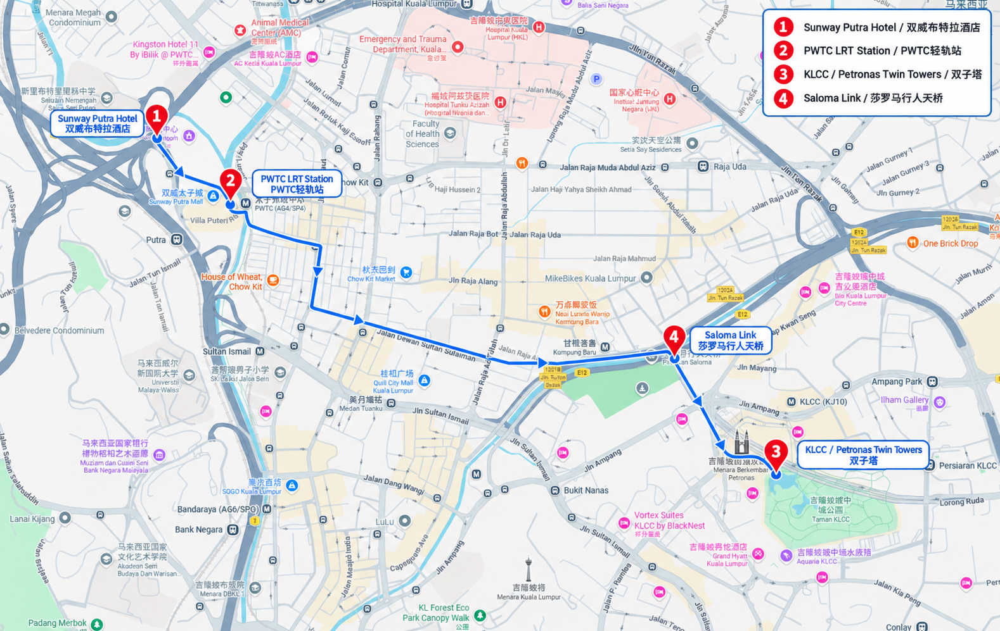

# 每日行程

## 关键地点速记 / Key Places

### 航班 / Flights

- 去程 / Outbound：AK113，10/15 广州 CAN T3 10:20 → 吉隆坡 KUL T2 14:40
- 返程 / Return：AK116，10/18 吉隆坡 KUL T2 16:35 → 广州 CAN T3 20:55

### 酒店 / Hotels

- 吉隆坡 / Kuala Lumpur：Sunway Putra Hotel Kuala Lumpur，Sunway Putra Mall, 100 Jalan Putra, Chow Kit, 50350 Kuala Lumpur
- 马六甲 / Melaka：Hatten Hotel Melaka，Jalan Merdeka, Banda Hilir, 75000 Melaka

### 全程记忆路线 / Route Memory

**广州白云 T3 → 吉隆坡 KUL T2 → Sunway Putra Hotel → KLCC → 马六甲 Hatten Hotel → Dutch Square / Jonker Walk → Melaka Straits Mosque → KUL T2 → 广州白云 T3**

其中机场和两家酒店是全程必经地点；KLCC、Dutch Square / Jonker Walk 和 Melaka Straits Mosque 是主要体验地点；Saloma Link 是可根据体力和天气取消的补充地点。
这里维护每日的详细路线。根目录 [README](../README.md) 只展示总计划和快速入口。

## Day 1 · 10/15：吉隆坡夜景

### 今日目标

今天只做一件事：顺利抵达、休息调整，然后用一个轻松的傍晚感受吉隆坡的现代城市夜景。第一天不安排大量景点，也不为了打卡在城市之间来回奔波。

### 时间线

| 时段 | 安排 | 说明 |
| --- | --- | --- |
| 下午 | 抵达 [KUL T2 / 吉隆坡国际机场](https://www.google.com/maps/search/?api=1&query=Kuala+Lumpur+International+Airport+Terminal+2)，完成入境、取行李并与接机司机会合 | 司机接到 4 人后直接前往 [Sunway Putra Hotel Kuala Lumpur / 双威布特拉酒店](https://www.google.com/maps/search/?api=1&query=Sunway+Putra+Hotel+Kuala+Lumpur) |
| 下午 | 酒店入住、休息、换衣服和补妆 | 不急着出门，先处理好个人状态 |
| 傍晚 | 前往 [KLCC](https://www.google.com/maps/search/?api=1&query=KLCC+Kuala+Lumpur) 和 [Petronas Twin Towers / 双子塔](https://www.google.com/maps/search/?api=1&query=Petronas+Twin+Towers+Kuala+Lumpur) | 以城市散步、双子塔拍照和周边用餐为主 |
| 晚上 | 视体力前往 [Saloma Link / 莎罗马行人天桥](https://www.google.com/maps/search/?api=1&query=Saloma+Link+Bridge+Kuala+Lumpur) | 作为补充夜景机位，下雨或疲劳时可以取消 |
| 晚上 | 晚餐后返回酒店 | 不再安排远距离景点，保持第一天轻松 |
### 地点说明

#### [KLCC](https://www.google.com/maps/search/?api=1&query=KLCC+Kuala+Lumpur) / [Petronas Twin Towers / 双子塔](https://www.google.com/maps/search/?api=1&query=Petronas+Twin+Towers+Kuala+Lumpur)

这是第一晚的核心区域。优点是城市景观集中，适合四人合照，也适合在商场、广场和周边步道之间灵活调整。建议至少留出一个半小时：先拍城市环境，再拍双子塔亮灯后的合照和个人照片。

如果大家抵达后明显疲惫，[KLCC](https://www.google.com/maps/search/?api=1&query=KLCC+Kuala+Lumpur) 本身就足够完成第一晚，不必强行前往其他地点。

#### [Saloma Link / 莎罗马行人天桥](https://www.google.com/maps/search/?api=1&query=Saloma+Link+Bridge+Kuala+Lumpur)

[Saloma Link / 莎罗马行人天桥](https://www.google.com/maps/search/?api=1&query=Saloma+Link+Bridge+Kuala+Lumpur) 适合作为双子塔之后的补充机位，可以拍桥体灯光、城市夜景和人物剪影。它不是第一天的必到点：如果下雨、排队、交通不顺或大家已经累了，直接取消不会影响当天体验。

### 当天交通建议

- 抵达 [KUL T2 / 吉隆坡国际机场](https://www.google.com/maps/search/?api=1&query=Kuala+Lumpur+International+Airport+Terminal+2) 后，完成入境和取行李，前往到达出口与 Trip.com 接机司机会合。`r`n- 司机接到 4 人后，直接前往 [Sunway Putra Hotel Kuala Lumpur / 双威布特拉酒店](https://www.google.com/maps/search/?api=1&query=Sunway+Putra+Hotel+Kuala+Lumpur)；不再现场临时安排机场交通。
- 酒店到 [KLCC](https://www.google.com/maps/search/?api=1&query=KLCC+Kuala+Lumpur) 建议使用 Grab；出发前确认车型能容纳 4 人和随身行李。
- [KLCC](https://www.google.com/maps/search/?api=1&query=KLCC+Kuala+Lumpur) 与 [Saloma Link / 莎罗马行人天桥](https://www.google.com/maps/search/?api=1&query=Saloma+Link+Bridge+Kuala+Lumpur) 是否步行衔接，以当天天气、体力和现场人流决定。
- 晚餐后直接回酒店，不再安排远距离夜景点。

### 拍照与穿搭建议

- 酒店休息时完成第一轮换衣服和补妆，减少到景区后反复折返。
- 双子塔建议拍两组：蓝调时刻一组、完全亮灯后一组。
- 四人合照最好在刚到 [KLCC](https://www.google.com/maps/search/?api=1&query=KLCC+Kuala+Lumpur) 时先完成，避免越晚人越累。
- [Saloma Link / 莎罗马行人天桥](https://www.google.com/maps/search/?api=1&query=Saloma+Link+Bridge+Kuala+Lumpur) 适合拍人物剪影和夜景，不必为单一机位等待太久。

### 弹性规则

- 航班或入境延误：保留 [KLCC](https://www.google.com/maps/search/?api=1&query=KLCC+Kuala+Lumpur)，取消 [Saloma Link / 莎罗马行人天桥](https://www.google.com/maps/search/?api=1&query=Saloma+Link+Bridge+Kuala+Lumpur)。
- 下午体力不足：酒店休息时间延长，晚餐就在 [KLCC](https://www.google.com/maps/search/?api=1&query=KLCC+Kuala+Lumpur) 解决。
- 天气不好：改为 [KLCC](https://www.google.com/maps/search/?api=1&query=KLCC+Kuala+Lumpur) 商场、室内用餐和短距离拍照。
- 大家特别喜欢 [KLCC](https://www.google.com/maps/search/?api=1&query=KLCC+Kuala+Lumpur)：可以停留更久，不需要为了完成后续地点赶路。
## Day 1 路线图 / Day 1 Route Map

### 地点链接 / Google Maps Links

1. [[Sunway Putra Hotel Kuala Lumpur / 双威布特拉酒店](https://www.google.com/maps/search/?api=1&query=Sunway+Putra+Hotel+Kuala+Lumpur) Kuala Lumpur / 双威布特拉酒店](https://www.google.com/maps/search/?api=1&query=Sunway+Putra+Hotel+Kuala+Lumpur)
2. [PWTC LRT Station / PWTC 轻轨站](https://www.google.com/maps/search/?api=1&query=PWTC+LRT+Station+Kuala+Lumpur)
3. [[KLCC](https://www.google.com/maps/search/?api=1&query=KLCC+Kuala+Lumpur) / [Petronas Twin Towers / 双子塔](https://www.google.com/maps/search/?api=1&query=Petronas+Twin+Towers+Kuala+Lumpur) / 双子塔](https://www.google.com/maps/search/?api=1&query=Petronas+Twin+Towers+Kuala+Lumpur)
4. [[Saloma Link / 莎罗马行人天桥](https://www.google.com/maps/search/?api=1&query=Saloma+Link+Bridge+Kuala+Lumpur) / 莎罗马行人天桥](https://www.google.com/maps/search/?api=1&query=Saloma+Link+Bridge+Kuala+Lumpur)

> 路线图用于记忆地点和大致方向；实际步行、乘车和入口位置以当天 Google Maps、现场标识和交通情况为准。
## Day 2 · 10/16：吉隆坡街区 → 公共交通前往马六甲

### 今日目标

上午在吉隆坡酒店附近和老城区慢慢游玩，下午回酒店取行李，再通过公共交通前往马六甲。行李不要带去上午的街区游览，先寄存在 Sunway Putra Hotel，减少换乘负担。

### 时间线

| 时段 | 安排 | 说明 |
| --- | --- | --- |
| 上午 | 酒店附近出发，前往鬼仔巷和茨厂街 | 不带大件行李，以街拍、建筑、咖啡和小吃为主 |
| 中午 | 在老城区午餐和休息 | 不安排连续打卡，给大家留出自由活动时间 |
| 下午 | 返回 Sunway Putra Hotel 取行李，再前往 TBS | 行李多或天气炎热时，酒店到 TBS 可改用 Grab |
| 下午至傍晚 | TBS 乘公共汽车前往 Melaka Sentral | 车次、票价和余票出发前确认，预留交通延误时间 |
| 傍晚 | Melaka Sentral 前往 Hatten Hotel Melaka | 带行李优先 Grab，到酒店后办理入住和休息 |
| 晚上 | Dutch Square、Christ Church、Jonker Walk 和夜市 | 视抵达时间和体力安排，累了就缩短路线 |
### 上午：酒店附近与吉隆坡老城区

#### 1. 从 Sunway Putra Hotel 到 PWTC LRT 站

酒店与 Sunway Putra Mall 相连，PWTC LRT 站位于商场附近。出门后先通过酒店/商场的连通通道找到 PWTC 站，不需要先叫车去市中心。

#### 2. PWTC → 茨厂街 / 鬼仔巷

建议路线：

1. 在 PWTC 站乘坐 Ampang Line 或 Sri Petaling Line，前往 Masjid Jamek。
2. 在 Masjid Jamek 换乘 Kelana Jaya Line，前往 Pasar Seni。
3. 从 Pasar Seni 步行前往 Petaling Street 茨厂街，再根据体力前往 Kwai Chai Hong 鬼仔巷。
4. 上午以一个步行区域为主，途中安排咖啡和小吃，不要继续扩展到过多景点。

### 下午：从酒店去 TBS，再坐公共汽车去马六甲

#### 1. 回酒店取行李

上午游览时不要携带大件行李。午餐后按原路返回酒店，取出寄存行李，并在酒店洗手间整理、补水和短暂休息。

#### 2. Sunway Putra Hotel → TBS

推荐公共交通路线：

1. 从酒店通过 Sunway Putra Mall 连通通道到 PWTC LRT 站。
2. 乘坐 Sri Petaling Line，方向选择 **Putra Heights**。
3. 在 **Bandar Tasik Selatan** 站下车。
4. 按站内指示通过连通通道前往 **TBS - Terminal Bersepadu Selatan**。
5. 到 TBS 后确认目的地为 **Melaka Sentral**，不要误买成其他马六甲站点。

这段路线的优点是费用较低、路线清楚；缺点是需要拖行李换乘。若 4 人行李较多、天气很热或出发较晚，可以把“酒店 → TBS”改为 Grab，保留 TBS → Melaka Sentral 的公共汽车。

#### 3. TBS → Melaka Sentral

- 购票目的地：**Melaka Sentral / 马六甲中央车站**。
- 购票时确认出发日期为 10 月 16 日、人数为 4 人，并尽量安排相邻座位。
- 车程通常约 2-3 小时，受道路交通影响；不要把抵达时间安排得过于紧凑。
- 上车前购买饮水和简单零食，贵重物品和护照放在随身包。
- 到达后先确认 4 人和行李齐全，再叫 Grab 去 Hatten Hotel。

#### 4. Melaka Sentral → Hatten Hotel Melaka

从 Melaka Sentral 到 Hatten Hotel 带着行李时优先选择 Grab，目的地输入：**Hatten Hotel Melaka, Jalan Merdeka, Banda Hilir, Melaka**。到酒店后先办理入住，再决定是否马上去古城；如果公共汽车延误，直接把夜市路线缩短为酒店附近晚餐和休息。

### 晚上：入住后的轻松路线

- 酒店入住、放行李、换衣服和补妆
- 体力正常：Dutch Square → Christ Church → Jonker Walk
- 想吃东西：以鸡场街夜市为主，不再额外安排远距离景点
- 体力不足或抵达较晚：酒店附近晚餐，第二天再完整游览

### 行李与交通注意事项

- 上午只带随身小包，护照、手机、钱包、充电宝随身保管。
- 大件行李寄存前确认酒店领取凭证和前台营业情况。
- TBS 和 Melaka Sentral 都是公共交通枢纽，提前截图车票、站名和酒店地址。
- 具体车次、票价和余票在出发前确认；本计划只固定路线，不固定某一班车。
## Day 3 · 10/17：马六甲慢游与海峡日落

- 上午慢游 A Famosa、St. Paul's Hill 和历史城区
- 中午安排娘惹菜
- 下午回酒店午睡、游泳、逛商场、喝咖啡或整理造型
- 约 16:30 出发前往 Melaka Straits Mosque
- 完整预留黄金时刻、日落、蓝调时刻和清真寺亮灯
- 晚上回古城吃饭、河边散步；有体力再继续逛鸡场街

## Day 4 · 10/18：马六甲 → KLIA2 → 广州

- 睡醒后早餐、退房并寄存行李
- 酒店附近散步、喝咖啡、买伴手礼和补拍照片
- 约 11:00 取行李，目标 11:30 左右离开马六甲
- 前往 KLIA2，机场吃饭、购物和休息
- 16:35 乘 AK116 飞回广州

## 节奏模板

睡醒 → 早餐 → 一个区域慢逛 → 拍照/咖啡 → 午餐 → 下午休息 → 傍晚重新出门 → 日落/夜景 → 晚餐/宵夜 → 回酒店。

## 待完善

- [ ] 为每一天补充最晚出发时间和“累了即可取消”的节点
- [ ] 为 Day 2 和 Day 3 增加雨天替代路线
- [ ] 补充酒店入住、退房、寄存行李和早餐时间

